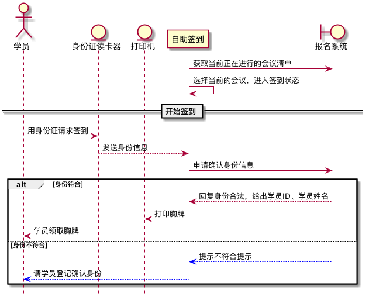

描述
-------------

源起
^^^^^^^^^^^^^

致良知四合院有大量的线下学习会，每次学习会需要给到场学员办理签到证明，并发放胸牌。之前的签到流程，是根据报名信息，提前一天或者半天打印好胸牌送到现场。现场有志愿者，当学员抵达时，进行签到记录，并查找学员的胸牌交给学员。

在理想情况下，这一流程可以准确的获得签到人员名单，但实际情况并非如此，而且时常遇到各种的异常情况。

举例如下：

* 学员信息不准确，姓名无法匹配，胸牌就无法找到，签到表中也无此学员
* 学员临时到场，胸牌无法找到，签到表中也无此学员
* 学员报名时间较晚，胸牌还未制作，签到表中也无此学员
* 学员信息正确，胸牌也有，但因为当时未能找到，制作临时胸牌
* 学员变更或者其他原因，造成同一学员具有多个胸牌，导下留下的胸牌（应该是未到）与签到记录中不一致
* 由于能制作临时胸牌，造成临时胸牌过多，无法统计
* 手工统计不严谨且只能延时提供统计表，无法实时提供
* 过多的人工干预，造成数据始终不能一致
* 大型学习会，可能有多个签到点，多种色彩大小不同的胸牌时，以上问题严重性提升数倍

经过分析，其本质是学员信息、签到信息与胸牌是不一致的，各种临时性方案均会导致数据的不一致，最终导致签到数据不准确，总有部分学员无法拿到自己的胸牌，签到数据总是混乱的，难以甚至无法数据化实时化的。

原则
^^^^^^^^^^^^^

* 必须先签到，再提供胸牌
* 学员信息不正确的，必须先修订正确
* 学员未报名的，必须先报名
* 学员有变更的，必须先变更
* 学员身份要符合唯一识别性

思路
^^^^^^^^^^^^^

考虑到学员姓名等信息，最准确的就是身份证，并且因为乘机、住店等因素，学员的身份证也将随身携带，即使未携带也可以手工输入，因此通过身份证进行人员识别和签到是相对合理的。

胸牌可以先制作底板，但无姓名等信息，签到后再实时打印出来，则可实现签到后再提供胸牌。

即以下标准流程：

#. 学员提供身份证，并主动在身份证读卡器上识别
#. 本应用收到身份证信息后被触发，向报名系统提交学员身份证信息（姓名、身份证号）
#. 报名系统返回该学员是否符合，若符合，本应用则调用打印机自动打印胸牌
#. 若不符合，则交由志愿者进行登记处理，直至登记上合法信息
#. 学员返回第一步重新操作，如果是护照或者其他，由志愿者协助录入

风险
^^^^^^^^^^^^^^

* 外设可能出故障
* 人短时间聚集时，因需要实时打印，可能等候时间过长

控制方案：

* 每个签到点至少2套设备
* 会务组备用至少2套应急设备

前置条件
-------------------

报名系统
^^^^^^^^^^^^^^^^^^^

目前已有线上报名系统，登记有会议信息与学员资料，也可对学员数据进行变更和删除。

需要新增：

#. 查询身份信息的接口
#. 登录签到点的接口
#. 查询签到记录的接口

物料准备
^^^^^^^^^^^^^^^^^^^^

* 身份证读卡器，华视CVR-100UC
* 打印机，爱普生打印机
* 空白胸卡

开发设计
---------------------

时序图
^^^^^^^^^^^^^^^^^^^^^

报名系统接口
^^^^^^^^^^^^^^^^^^^^^

| 访问安全，采用报名系统提供的 API Token

登录签到点
"""""""""""""""""""""

::

    POST https://meeting.wangyangming.org.cn/meeting/api/login

传入数据格式为 `JSON`

.. code:: json

    {
      "code": "223895"
    }

返回数据格式为 `JSON`

.. code:: json

    {
      "id": 2,
      "name": "大学生学习会",
      "point": "筑梦空间",
      "token": "2289-3365-312345"
    }

查找失败返回
    
.. code:: json
        
    {
      "result": "fail",
      "reason": "没有匹配的签到点"
    }

核查身份信息
"""""""""""""""""""

::

    POST https://meeting.wangyangming.org.cn/meeting/api/idcards

传入数据格式 `JSON`

.. code:: json

    {
      "meetingId": 2,
      "idcard": "5101**19******21*X",
      "name": "苏**",
      "token": "2289-3365-312345"
    }

**注意：身份证号最后一位如果是 x，则转为大写**

返回数据格式为 `JSON`

当查找成功时:
    
.. code:: json

    {
        "id": 20537,
        "idcard": "5101**19******21*X",
        "name": "苏**"
        "organ": "成都软创互联****公司",
        "mobile": "189****3365"
    }

查找失败时:
    
.. code:: json
    
    {
      "result": "fail",
      "reason": "没有匹配的身份证号码，也没有匹配的姓名"
    }

其中错误原因有以下几种情况：

#. 没有匹配的身份证号码，也没有匹配的姓名
#. 没有匹配的身份证号码，也能匹配到姓名，但匹配姓名的未签到学员超过 2 人
#. 该学员已经签到，此时会附加人员信息，并可补打胸牌
#. 非法的Token，需要重新登录

查询签到记录
"""""""""""""""""""""""

::

    GET https://meeting.wangyangming.org.cn/meeting/api/records?token=2289-3365-312345

返回数据格式为`JSON`

找到符合的记录:

.. code:: json

    [
      {
        "id": 20537,
        "idcard": "5101**19******21*X",
        "name": "苏**",
        "organ": "成都软创互联****公司",
        "mobile": "189****3365",
        "count": 1
      }
    ]

查找失败时:
    
.. code:: json

    {
      "result": "fail",
      "reason": "非法的 Token"
    }

其中错误原因有以下几种情况：

#. 非法的Token，需要重新登录

用例清单
------------------------

身份证签到
^^^^^^^^^^^^^^^^^^^^^^

**基本流程**

#. 读取身份证信息

    - 未携带身份证或者无身份证者
        - 手工录入证件号码与真实姓名

#. 确认学员合法性

    - 确认失败的学员
        - 请到咨询处确认
        - 重新签到

#. 打印胸牌
#. 交付胸牌

**优先级**: 高

**执行人**: 会务人员

补打胸牌
^^^^^^^^^^^^^^^^^^^^^^

**基本流程**

#. 输入身份证号
#. 确认已经签到
#. 选择补打胸牌
#. 交付胸牌

**优先级**: 中

**执行者**: 会务人员

补充说明
-------------------------

* 由于要连接外设，所以需要在 Windows 系统下实现对接
* 本应用不关注签到数据的统计，由报名系统处理
