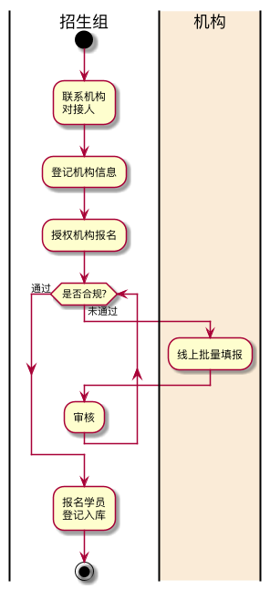

.. _entry_group:

团队报名
===========

描述
-----------

团队报名是指机构组织学员统一申请参加会议。

现状
^^^^^^^^^^^^

目前，是由招生组将报名的电子表格发给各个机构的负责人，
机构负责人填报好电子表格后，再返回给招生组负责人，
然后再由招生组负责人导入系统。

这个过程非常的不方便，存在以下问题难以解决。

#. 报名学员的任何变更，都需要招生组负责人修订
#. 电子表格经常被填写人随意修改，造成无法导入
#. 电子表格中经常有错误的数据格式，无法及时发现
#. 对于会议特定的数据项，需要单独设置电子表格

因此，团队报名必须要重新设计。

需求
------------

主流程图
^^^^^^^^^^^^

用例清单
^^^^^^^^^^^^^

#. [UC-20201] 登记报名机构信息
#. [UC-20202] 颁发机构报名授权码
#. [UC-20203] 线上批量报名
#. [UC-20204] 审核团队批名
#. [UC-20205] 增加报名学员
#. [UC-20206] 变更报名学员
#. [UC-20207] 撤销报名学员
#. [UC-20208] 增加与变更的审核

设计
------------

领域架构图
^^^^^^^^^^^^

原型设计
^^^^^^^^^^^^

